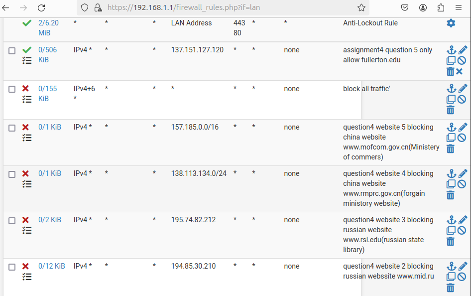
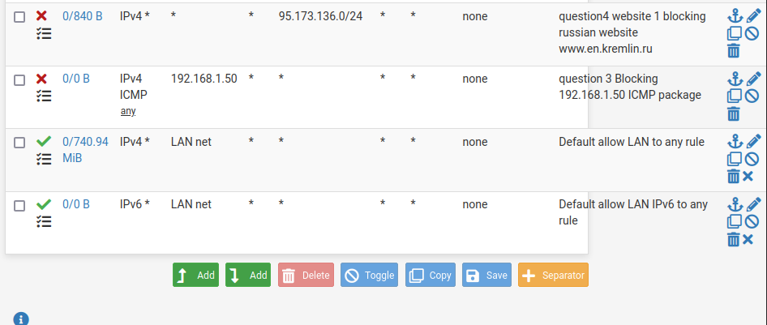

# Firewall-Configuration-Network-Security-Project

## Overview
This project demonstrates **firewall security configurations** using **pfSense**, focusing on:
- **Anti-Spoofing Policies**
- **LAN-to-WAN ICMP Blocking**
- **Geolocation-Based IP Blocking (Russia & China)**
- **Restricted HTTPS Access to Specific Domains**
- **Firewall Log Analysis**

## Tools Used
- pfSense Firewall
- hping3 (Security Testing)
- Wireshark (Packet Analysis)
- Network Traffic Logs

## Firewall Rules Implemented
1. **Blocking Spoofed Traffic**
2. **Restricting Outgoing ICMP Traffic**
3. **Geolocation-Based IP Blocking**
4. **Allowing Only HTTPS to Specific Sites**
5. **Monitoring and Logging Security Events**

## Results
- Prevented unauthorized traffic from spoofed sources.
- Successfully blocked traffic to/from restricted IP ranges.
- Enhanced **network security and traffic visibility**.

## Document
Please refer to document to see all the implementation.

## pfsense configuration screenshot

---
### **Contributors**
- **Sagar Patel** - Cybersecurity Enthusiast 🔒
- Connect with me on **[LinkedIn](https://linkedin.com/in/sagarpatel)**.
